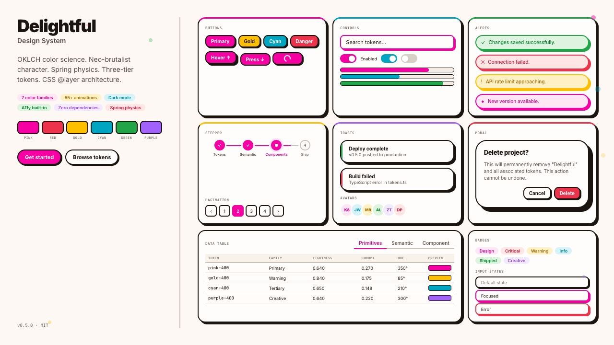

# Delightful

A warm, neo-brutalist design system for editors, terminals, notes, agents, and personal tooling.

[Visit delightful.build](https://delightful.build/) · [Design System](delightful-design-system.html) · [Color](delightful-color.html) · [Motion](delightful-motion.html) · [Animation](delightful-animation.html) · [Issues](https://github.com/kylesnav/delightful-design-system/issues)



Delightful is built around OKLCH color, sturdy 2px borders, hard offset shadows, and motion that feels quick without feeling twitchy. This repo is the public `delightful.build` site and the source-of-truth reference for the system.

## Explore

| Page | What it is |
|---|---|
| [Homepage](index.html) | Public front door and ecosystem hub for Delightful. |
| [Design System](delightful-design-system.html) | Canonical reference for tokens, components, interactions, and composition. |
| [Color](delightful-color.html) | OKLCH primitives, semantic roles, component bindings, and palette exploration. |
| [Motion](delightful-motion.html) | CSS motion vocabulary, timing tokens, reduced-motion behavior, and animation patterns. |
| [Animation](delightful-animation.html) | JavaScript springs, particles, FLIP, gestures, and generative animation demos. |
| [Screenshots](screenshots/) | Public visual assets used by the site and ecosystem previews. |
| [Tests](tests/) | Playwright checks for token consistency, interaction behavior, animations, and visual coverage. |

## Ecosystem

Delightful ships across the tools I actually use. This repo is the hub and site source; platform ports now live in standalone repos instead of copied directories here.

| Surface | Repo | What it gives you |
|---|---|---|
| Claude Code | [delightful-claude-plugin](https://github.com/kylesnav/delightful-claude-plugin) | Skills, agents, MCP tools, and design-system context. |
| VS Code | [delightful-vscode](https://github.com/kylesnav/delightful-vscode) | Light and dark editor color themes. |
| Obsidian | [obsidian-delightful](https://github.com/kylesnav/obsidian-delightful) | Community theme with modular CSS source. |
| Ghostty | [delightful-ghostty](https://github.com/kylesnav/delightful-ghostty) | Terminal themes, config, and optional shaders. |
| iTerm2 | [delightful-iterm2](https://github.com/kylesnav/delightful-iterm2) | Generated `.itermcolors` profiles. |
| Starship | [delightful-starship](https://github.com/kylesnav/delightful-starship) | Rainbow powerline prompt theme. |
| Shell | [delightful-shell](https://github.com/kylesnav/delightful-shell) | tmux, zsh, auto-attach, and smart-open utilities. |
| Setup | [claude-setup](https://github.com/kylesnav/claude-setup) | Machine setup orchestration for the full environment. |

## Design Principles

- **OKLCH color**: perceptual color primitives with warm neutrals and bright, controlled accents.
- **Three-tier tokens**: primitives feed semantic tokens, and semantic tokens feed component tokens.
- **Physical depth**: hard zero-blur shadow offsets pair with ambient depth layers.
- **Confident structure**: 2px solid borders are the default, with softer states documented where needed.
- **Motion with respect**: light/dark themes and reduced-motion behavior are first-class parts of the system.

## For Contributors

This is a static site repo. Open the HTML files directly or serve the folder with any local static server.

```sh
npm install
npm test
```

Use `npm run bump <version>` only when cutting a site/design-system release. It updates this repo's root package version and creates a tag. Platform ports release from their own repos.

Detailed operating rules live in [AGENTS.md](AGENTS.md) and [CLAUDE.md](CLAUDE.md).

## License

[MIT](LICENSE)
