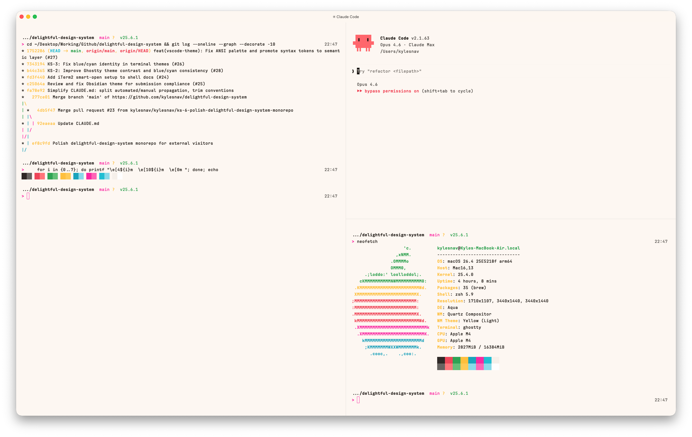

<p align="center">
  <picture>
    <source media="(prefers-color-scheme: dark)" srcset="screenshots/Ghostty-Dark.png" />
    <source media="(prefers-color-scheme: light)" srcset="screenshots/Ghostty-Light.png" />
    
  </picture>
</p>

<h1 align="center">Delightful for Ghostty</h1>

<p align="center">
  Warm terminal colors derived from the <a href="https://github.com/kylesnav/delightful-design-system">Delightful Design System</a>.
</p>

---

## The Delightful Terminal Stack

| Package | Role |
|---------|------|
| **`ghostty/`** (this package) | Terminal emulator — colors, fonts, keybinds |
| [`starship/`](../starship/) | Prompt — rainbow powerline segments |
| [`shell/`](../shell/) | Session — tmux status bar, persistence, zsh config |
| [`iterm2/`](../iterm2/) | iTerm2 color profiles (standalone alternative) |

## Theme

The color theme is portable — install it on any Ghostty setup.

### Install

Copy the theme files into Ghostty's theme directory:

```bash
mkdir -p ~/.config/ghostty/themes
cp themes/delightful-light themes/delightful-dark ~/.config/ghostty/themes/
```

Then set your theme in `~/.config/ghostty/config`:

```
theme = delightful-light
```

Or `delightful-dark` for dark mode.

### Color Mapping

All colors map to Delightful Design System tokens. Blue slots use the cyan hue at different lightness levels since Delightful has no dedicated blue. Bright yellow reuses normal yellow in light mode for legibility on the cream background.

<details>
<summary><strong>Full token mapping</strong></summary>

<br>

| Terminal Color | Design Token | Light | Dark |
|----------------|--------------------------|-----------|-----------|
| Background | bg-page | `#fdf8f3` | `#1e1a16` |
| Foreground | text-primary | `#1b150f` | `#eee9e3` |
| Cursor | accent-primary (pink) | `#f600a3` | `#ff4fa8` |
| Selection BG | accent-primary-subtle | `#ffe6f4` | `#3d2235` |
| Black | neutral-950 | `#16100c` | `#1e1a16` |
| Red | red-400 | `#ed324b` | `#e8554c` |
| Green | green-400 | `#22a448` | `#3aad5f` |
| Yellow | gold-500 | `#c67e00` | `#f5c526` |
| Blue | cyan-400 | `#00a6c0` | `#00a6c0` |
| Magenta | pink-400 | `#f600a3` | `#ff4fa8` |
| Cyan | cyan-300 | `#17c0d6` | `#5cb8d6` |
| White | neutral-100 | `#f6f1eb` | `#eee9e3` |

</details>

## Full Experience

The included config file goes beyond colors — fonts, keybinds, window chrome, and tmux integration. This is opinionated and personal.

### Install

```bash
cp config ~/.config/ghostty/config
```

### What's Included

| Feature | Details |
|---------|---------|
| JetBrains Mono | 14px, thickened, with OpenType features (cv02–cv04, cv11) |
| macOS tab bar | `macos-titlebar-style = tabs` with server-side window decoration |
| tmux splits | `Cmd+D` / `Cmd+Shift+D` create tmux panes (auto-equalized), `Cmd+Shift+W` closes a pane |
| tmux auto-attach | Each window gets a persistent tmux session via `tmux-auto-attach` |
| Copy on select | Selected text copies to clipboard automatically |
| 10M scrollback | Generous scrollback buffer |

### Shaders

Optional GLSL post-processing effects (vignette, bloom):

```bash
# macOS
cp shaders/*.glsl ~/Library/Application\ Support/com.mitchellh.ghostty/shaders/

# Linux
cp shaders/*.glsl ~/.config/ghostty/shaders/
```

Uncomment the `custom-shader` lines in your config to enable.

### Claude Code

After applying the theme, run `/config` in Claude Code and set the theme to **light-ansi** or **dark-ansi** (matching your terminal theme). Claude Code inherits the Delightful palette from your terminal.

## Related

- [`shell/`](../shell/) — tmux, zsh config, and terminal utilities
- [`starship/`](../starship/) — Starship prompt theme
- [`iterm2/`](../iterm2/) — iTerm2 color profiles using the same palette

## License

[MIT](LICENSE)
