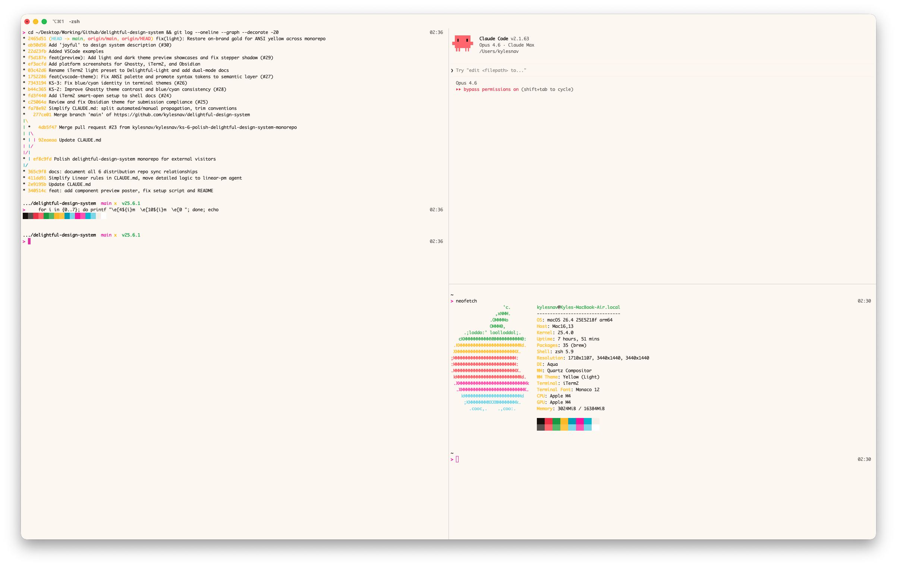

<p align="center">
  <picture>
    <source media="(prefers-color-scheme: dark)" srcset="screenshots/iTerm2-Dark.png" />
    <source media="(prefers-color-scheme: light)" srcset="screenshots/iTerm2-Light.png" />
    
  </picture>
</p>

<h1 align="center">Delightful for iTerm2</h1>

<p align="center">
  Warm terminal colors derived from the <a href="https://github.com/kylesnav/delightful-design-system">Delightful Design System</a>.
</p>

---

## Theme

The color profiles are portable — import them into any iTerm2 setup.

### Install

```bash
open colors/Delightful-Light.itermcolors
open colors/Delightful-Dark.itermcolors
```

Or import manually: **Settings > Profiles > Colors > Color Presets... > Import...**

### Automatic light/dark switching

1. Go to **Settings > Profiles > Colors**
2. Check **"Use separate colors for light and dark mode"**
3. Set **Editing** to **Light Mode**
4. Click **Color Presets...** and select **Delightful-Light** > **Update Light Mode Only**
5. Set **Editing** to **Dark Mode**
6. Click **Color Presets...** and select **Delightful-Dark** > **Update Dark Mode Only**

iTerm2 will switch between light and dark colors automatically with macOS appearance.

### Color Mapping

All colors map to Delightful Design System tokens. The palette is identical to the [Ghostty theme](../ghostty/) — both are generated from the same OKLCH primitives.

<details>
<summary><strong>Full token mapping</strong></summary>

<br>

| Terminal Color | Design Token | Light | Dark |
|----------------|--------------------------|-----------|-----------|
| Background | bg-page | `#fdf8f3` | `#1e1a16` |
| Foreground | text-primary | `#1b150f` | `#eee9e3` |
| Cursor | accent-primary (pink) | `#f600a3` | `#ff4fa8` |
| Selection BG | accent-primary-subtle | `#ffe6f4` | `#3d2235` |
| Black | neutral-950 | `#16100c` | `#1e1a16` |
| Red | red-400 | `#ed324b` | `#e8554c` |
| Green | green-400 | `#22a448` | `#3aad5f` |
| Yellow | gold-500 | `#c67e00` | `#f5c526` |
| Blue | cyan-400 | `#00a6c0` | `#00a6c0` |
| Magenta | pink-400 | `#f600a3` | `#ff4fa8` |
| Cyan | cyan-300 | `#17c0d6` | `#5cb8d6` |
| White | neutral-100 | `#f6f1eb` | `#eee9e3` |
| Bright Black | neutral-600 | `#615d58` | `#615d58` |
| Bright Red | red-300 | `#ff6e74` | `#ff6e74` |
| Bright Green | green-300 | `#60c072` | `#60c072` |
| Bright Yellow | gold-500 | `#c67e00` | `#ffcb3f` |
| Bright Blue | cyan-200 | `#88ddec` | `#88ddec` |
| Bright Magenta | pink-300 | `#ff5cb8` | `#ff7cc6` |
| Bright Cyan | cyan-200 | `#88ddec` | `#88ddec` |
| Bright White | white | `#ffffff` | `#ffffff` |

Blue slots use the cyan hue at different lightness levels since Delightful has no dedicated blue.
Bright yellow reuses normal yellow in light mode for legibility on the cream background.

</details>

## Full Experience

Recommended settings that make iTerm2 feel more polished. These are opinionated preferences, not required for the theme.

### Appearance

| Setting | Path | Value |
|---------|------|-------|
| Theme | Appearance > General > Theme | **Minimal** |
| Pane title bars | Appearance > Panes > "Show per-pane title bar..." | **Off** |
| Scroll bars | System Settings > Appearance > "Show scroll bars" | **When scrolling** |
| Font | Profiles > Text > Font | **Monaco 12** |

<details>
<summary><strong>tmux integration</strong></summary>

<br>

Settings under **General > tmux**:

| Setting | Value |
|---------|-------|
| Restore windows as | **Tabs in the attaching window** |
| Bury tmux client after connecting | **On** |
| Use "tmux" profile | **Off** |
| Status bar shows tmux content | **On** |
| Pause pane catch-up threshold | **120s** |
| Warn before pausing | **On** |
| Unpause automatically | **Off** |
| Mirror paste buffer | **Off** |

</details>

<details>
<summary><strong>Shift+Enter for Claude Code</strong></summary>

<br>

By default, iTerm2's Shift+Enter submits instead of inserting a newline. To fix this (matching Ghostty behavior):

1. Go to **Settings > Profiles > Keys > Key Mappings**
2. Add or edit the Shift+Enter mapping
3. Set **Action** to **Send Hex Code**, value `0a`

Or apply via command line:

```bash
/usr/libexec/PlistBuddy -c "Add ':New Bookmarks:0:Keyboard Map:0xd-0x20000-0x24' dict" ~/Library/Preferences/com.googlecode.iterm2.plist 2>/dev/null
/usr/libexec/PlistBuddy -c "Add ':New Bookmarks:0:Keyboard Map:0xd-0x20000-0x24:Action' integer 11" ~/Library/Preferences/com.googlecode.iterm2.plist 2>/dev/null || \
/usr/libexec/PlistBuddy -c "Set ':New Bookmarks:0:Keyboard Map:0xd-0x20000-0x24:Action' 11" ~/Library/Preferences/com.googlecode.iterm2.plist
/usr/libexec/PlistBuddy -c "Add ':New Bookmarks:0:Keyboard Map:0xd-0x20000-0x24:Text' string 0a" ~/Library/Preferences/com.googlecode.iterm2.plist 2>/dev/null || \
/usr/libexec/PlistBuddy -c "Set ':New Bookmarks:0:Keyboard Map:0xd-0x20000-0x24:Text' 0a" ~/Library/Preferences/com.googlecode.iterm2.plist
```

Restart iTerm2 after applying.

</details>

### Claude Code

After applying the theme, run `/config` in Claude Code and set the theme to **light-ansi** or **dark-ansi** (matching your terminal theme). Claude Code inherits the Delightful palette from your terminal.

## Regenerating

If token hex values change, regenerate the profiles:

```bash
node scripts/generate-profiles.mjs
```

The hex palette matches the Ghostty theme files exactly — update one, update both.

## Related

- [`shell/`](../shell/) — Starship prompt and zsh config (works with any terminal)
- [`ghostty/`](../ghostty/) — Ghostty theme using the same palette

## License

[MIT](LICENSE)
