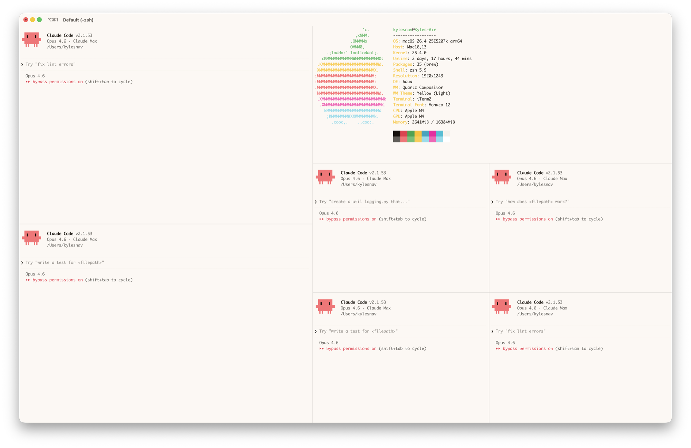

# iTerm2 — Delightful Theme

iTerm2 color profiles derived from the Delightful Design System.



## Contents

```
colors/
  Delightful.itermcolors        Light color profile (XML plist)
  Delightful-Dark.itermcolors   Dark color profile (XML plist)
scripts/
  generate-profiles.mjs         Generates profiles from hex palette
```

## Regenerate Profiles

If primitive token hex values change, regenerate the profiles:

```bash
node iterm2/scripts/generate-profiles.mjs
```

The hex palette in the script matches the Ghostty theme files exactly — update one, update both.

## Install Color Profile

### Import via iTerm2 Settings

1. Open iTerm2
2. Go to **Settings > Profiles > Colors**
3. Click the **Color Presets...** dropdown (bottom right)
4. Select **Import...**
5. Navigate to `colors/Delightful.itermcolors` (or `Delightful-Dark.itermcolors`) and open it
6. Click **Color Presets...** again and select **Delightful** (or **Delightful-Dark**)

### Import via command line

```bash
open colors/Delightful.itermcolors
```

This opens the file in iTerm2 and registers the color preset. Then select it in Settings > Profiles > Colors > Color Presets.

## Recommended iTerm2 Settings

These settings make iTerm2 look cleaner and closer to Ghostty's minimal chrome:

| Setting | Path | Value |
|---------|------|-------|
| Theme | Appearance > General > Theme | **Minimal** |
| Pane title bars | Appearance > Panes > "Show per-pane title bar with split panes" | **Off** |
| Scroll bars | System Settings > Appearance > "Show scroll bars" | **When scrolling** |

## Key Mappings

### Shift+Enter → Newline (for Claude Code)

By default iTerm2 sends a CSI u escape sequence for Shift+Enter, which Claude Code treats the same as Enter (submit). To make Shift+Enter insert a newline instead (matching Ghostty behavior):

1. Open iTerm2
2. Go to **Settings > Profiles > Keys > Key Mappings**
3. Click **+** (or edit the existing Shift+Enter mapping)
4. Set **Keyboard Shortcut** to **Shift+Enter**
5. Set **Action** to **Send Hex Code**
6. Set **Value** to `0a`
7. Click **OK**

Or apply via command line:

```bash
/usr/libexec/PlistBuddy -c "Add ':New Bookmarks:0:Keyboard Map:0xd-0x20000-0x24' dict" ~/Library/Preferences/com.googlecode.iterm2.plist 2>/dev/null
/usr/libexec/PlistBuddy -c "Set ':New Bookmarks:0:Keyboard Map:0xd-0x20000-0x24:Action' 11" ~/Library/Preferences/com.googlecode.iterm2.plist
/usr/libexec/PlistBuddy -c "Set ':New Bookmarks:0:Keyboard Map:0xd-0x20000-0x24:Text' 0a" ~/Library/Preferences/com.googlecode.iterm2.plist
```

Restart iTerm2 after applying.

## Starship Prompt & Zsh

See [`shell/README.md`](../shell/README.md) for the shared Starship prompt and zsh config. These work with any terminal.

## Claude Code

After applying the iTerm2 theme, run `/config` in Claude Code and set the theme to **light-ansi**. This makes Claude Code inherit the Delightful palette from your terminal.

## Token Mapping

| Terminal Color | Design Token | Light Hex | Dark Hex |
|----------------|--------------------------|-----------|-----------|
| Background | bg-page | `#fdf8f3` | `#1e1a16` |
| Foreground | text-primary | `#1b150f` | `#eee9e3` |
| Cursor | accent-primary (pink) | `#f600a3` | `#ff4fa8` |
| Selection BG | accent-primary-subtle | `#ffe6f4` | `#3d2235` |
| Black | neutral-950 | `#16100c` | `#1e1a16` |
| Red | red-400 | `#ed324b` | `#e8554c` |
| Green | green-400 | `#22a448` | `#3aad5f` |
| Yellow | gold-500 | `#c67e00` | `#f5c526` |
| Blue | cyan-400 | `#00a6c0` | `#00a6c0` |
| Magenta | pink-400 | `#f600a3` | `#ff4fa8` |
| Cyan | cyan-300 | `#17c0d6` | `#5cb8d6` |
| White | neutral-100 | `#f6f1eb` | `#eee9e3` |
| Bright Black | neutral-600 | `#615d58` | `#615d58` |
| Bright Red | red-300 | `#ff6e74` | `#ff6e74` |
| Bright Green | green-300 | `#60c072` | `#60c072` |
| Bright Yellow | gold-500 | `#c67e00` | `#ffcb3f` |
| Bright Blue | cyan-200 | `#88ddec` | `#88ddec` |
| Bright Magenta | pink-300 | `#ff5cb8` | `#ff7cc6` |
| Bright Cyan | cyan-200 | `#88ddec` | `#88ddec` |
| Bright White | white | `#ffffff` | `#ffffff` |

Blue slots use the cyan hue at different lightness levels since Delightful has no dedicated blue.
Bright yellow reuses the normal yellow in light mode to preserve legibility on the cream background.

## References

| Tool | Repo | Docs |
|------|------|------|
| iTerm2 | [gnachman/iTerm2](https://github.com/gnachman/iTerm2) | [iterm2.com](https://iterm2.com) |
| Claude Code | [anthropics/claude-code](https://github.com/anthropics/claude-code) | [docs.anthropic.com](https://docs.anthropic.com/en/docs/claude-code) |
| Starship | [starship/starship](https://github.com/starship/starship) | [starship.rs](https://starship.rs) |
