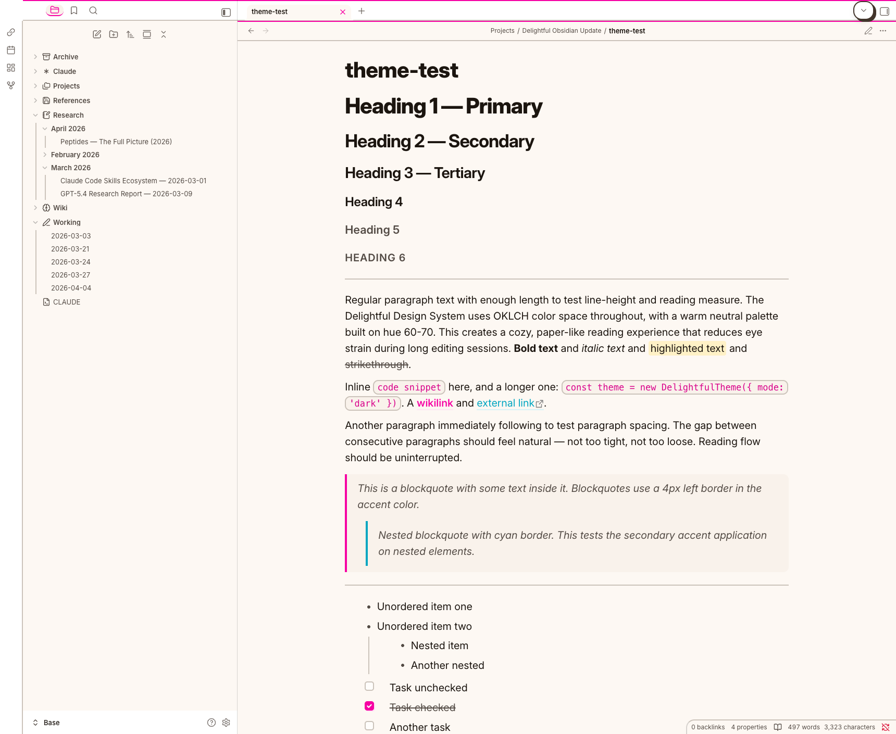
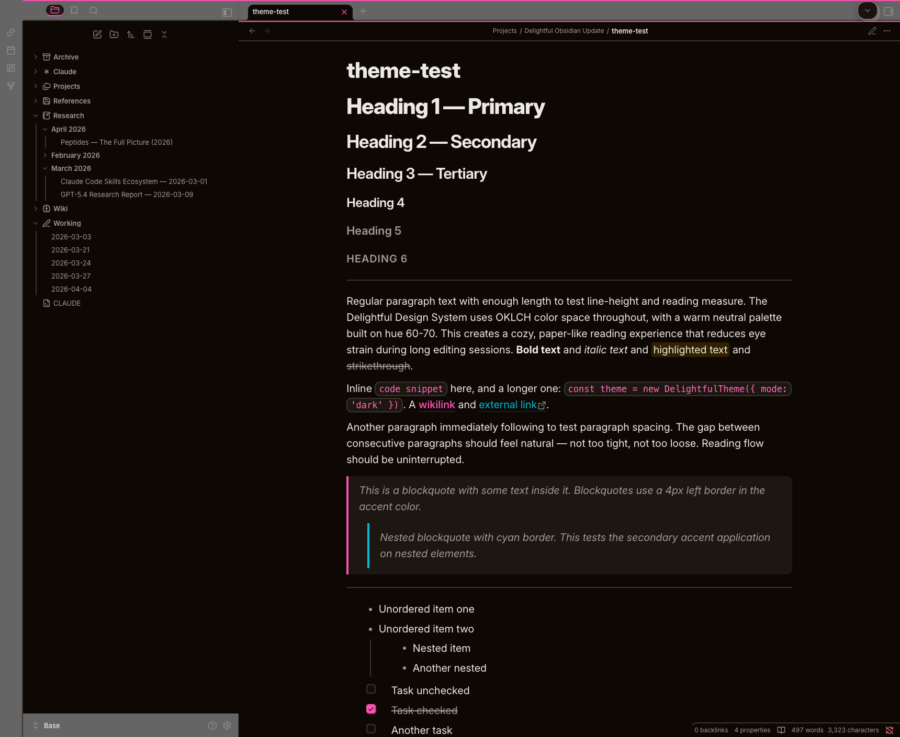
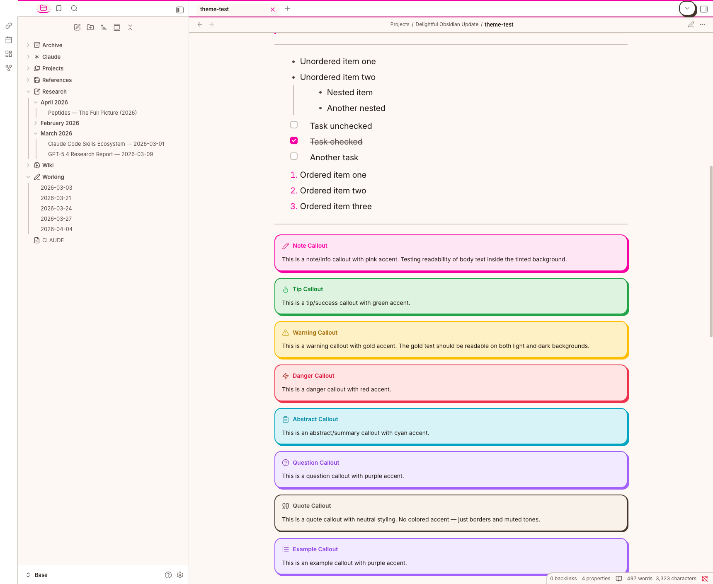
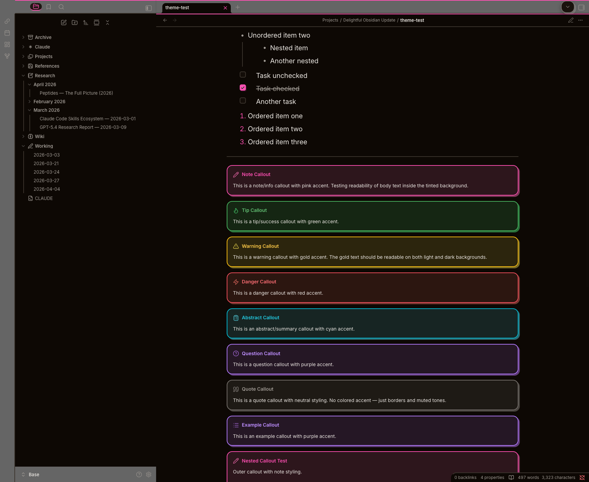

<p align="center">
  
</p>

<h1 align="center">Delightful</h1>

<p align="center">
  A warm, neo-brutalist theme for <a href="https://obsidian.md">Obsidian</a>.<br>
  Bold borders. Solid shadows. Warm neutrals. Never cold gray.
</p>

<p align="center">
  <a href="#install">Install</a> &nbsp;·&nbsp;
  <a href="#features">Features</a> &nbsp;·&nbsp;
  <a href="#style-settings">Style Settings</a> &nbsp;·&nbsp;
  <a href="#screenshots">Screenshots</a> &nbsp;·&nbsp;
  <a href="#design-system">Design System</a>
</p>

---

## Screenshots

|  |  |
|---|---|
|  |  |
| **Light mode** — warm paper tones | **Dark mode** — cozy dark neutrals |

|  |  |
|---|---|
|  |  |
| **Callouts** — 8 color-coded types | **Dark callouts** — visible tinted backgrounds |

## Install

### Community Themes (Recommended)

1. Open **Settings > Appearance**
2. Click **Manage** next to Themes
3. Search for **Delightful**
4. Click **Install and use**

### Manual

1. Download `theme.css` and `manifest.json` from [Releases](https://github.com/kylesnav/delightful-design-system/releases)
2. Create `.obsidian/themes/Delightful/` in your vault
3. Place both files inside
4. Select **Delightful** in **Settings > Appearance**

## Features

### Color & Visual Language

- **OKLCH color palette** — warm neutrals on hue 70, 6 accent families with perceptually uniform color math. No cold grays anywhere.
- **Neo-brutalist aesthetic** — solid offset shadows with ambient depth, 2px borders, generous radii (10/16/24px). Every surface feels tangible.
- **Light & dark mode** — warm tan in light, cozy dark neutrals in dark. Accent colors adjust brightness per mode for consistent readability.

### Typography

- **Distinct heading scale** — H1 (2.074em) through H6 (1em), each level visibly different. H6 uses uppercase + letter-spacing for distinction at body size.
- **Natural paragraph rhythm** — 0.75rem gap between consecutive paragraphs. Heading margins use a 2:1 ratio (24px top / 12px bottom) so headings associate with the content they introduce.
- **Proportional inline code** — 85% of parent font size with 2px borders and 10px radius. Reads naturally in flowing prose without disrupting line height.

### Content Surfaces

- **8 callout types** — note, tip, warning, danger, abstract, question, quote, example. Each with semantically matched colors, shadows, and icons. Nested callouts supported.
- **Syntax highlighting** — keywords (pink), strings (gold), functions (cyan), comments (green), types (purple), numbers (red). Consistent accent mapping.
- **Tables** — rounded card treatment with uppercase muted headers, alternating row tints, and hover states.
- **Task lists** — warm checkboxes with accent hover preview, shadow on checked state, and satisfying click squeeze animation. Nested code blocks flow full-width below task text.

### Workspace

- **Themed scrollbars** — subtle thumb with accent hover, transparent track.
- **Canvas** — 6 color-coded node types with tinted backgrounds, styled edges and controls.
- **Graph view** — themed control panel with styled sliders, toggles, and color group pickers.
- **Mobile optimized** — larger touch targets (44px minimum), reduced shadows, phone-appropriate heading scale, bottom action bar.

### Plugin Compatibility

Tested and styled out of the box:

| Plugin | What's Styled |
|--------|--------------|
| [Style Settings](https://github.com/mgmeyers/obsidian-style-settings) | Full customization panel (see below) |
| [Dataview](https://github.com/blacksmithgu/obsidian-dataview) | Tables with neo-brutalist borders |
| [Kanban](https://github.com/mgmeyers/obsidian-kanban) | Lanes, cards, headers, drag handles |
| [Calendar](https://github.com/liamcain/obsidian-calendar-plugin) | Sidebar widget with activity dots |
| [Tasks](https://github.com/obsidian-tasks-group/obsidian-tasks) | Priority indicators, due dates, overdue styling |
| [Excalidraw](https://github.com/zsviczian/obsidian-excalidraw-plugin) | Canvas toolbar and panels |

## Style Settings

Install [Style Settings](https://github.com/mgmeyers/obsidian-style-settings) for these options:

| Setting | Options | Default |
|---------|---------|---------|
| **Accent Color** | Pink, Danger, Gold, Cyan, Green, Purple | Pink |
| **Shadow Style** | Neo-brutalist, Subtle, None | Neo-brutalist |
| **Border Weight** | 2px, 1px | 2px |
| **Heading Scale** | Normal, Compact, Large | Normal |
| **Animations** | On, Off | On |

## Design System

Delightful is built on the [Delightful Design System](https://github.com/kylesnav/delightful-design-system) — a cross-platform design system spanning Obsidian, VS Code, Ghostty, iTerm2, Starship, and Claude Code.

<details>
<summary><strong>Token architecture</strong></summary>

<br>

The theme uses a 3-tier token architecture:

| Tier | Purpose | Example |
|------|---------|---------|
| **Primitives** | Raw OKLCH values | `--primitive-pink-400: oklch(0.640 0.270 350)` |
| **Semantic** | Contextual meaning, mode-aware | `--accent-primary: var(--primitive-pink-400)` |
| **Component** | Shared infrastructure | `--shadow-md: 4px 4px 0 var(--border-default)` |

Components reference semantic tokens. Semantic tokens reference primitives. Primitives are never used directly in component CSS.

**Typography:** Inter for text, JetBrains Mono for code. Fluid type scale from step-0 (1rem) to step-5 (2.488rem).

**Motion:** 5 durations (100ms–500ms), 5 easings including spring curves via `linear()`. Hover lifts, press squeezes, and entrance animations.

</details>

## Development

```bash
# Build theme from modular source files
node obsidian-theme/build.js

# Watch mode — rebuilds on file changes
node obsidian-theme/build.js --watch

# Visual audit — captures 60 CDP screenshots
python3 obsidian-theme/scripts/visual-audit.py
```

Source CSS is split into 12 modules in `src/` plus 4 plugin overrides in `src/plugins/`.

## License

[MIT](LICENSE)

---

<p align="center">
  Part of the <a href="https://github.com/kylesnav/delightful-design-system">Delightful Design System</a>
</p>
