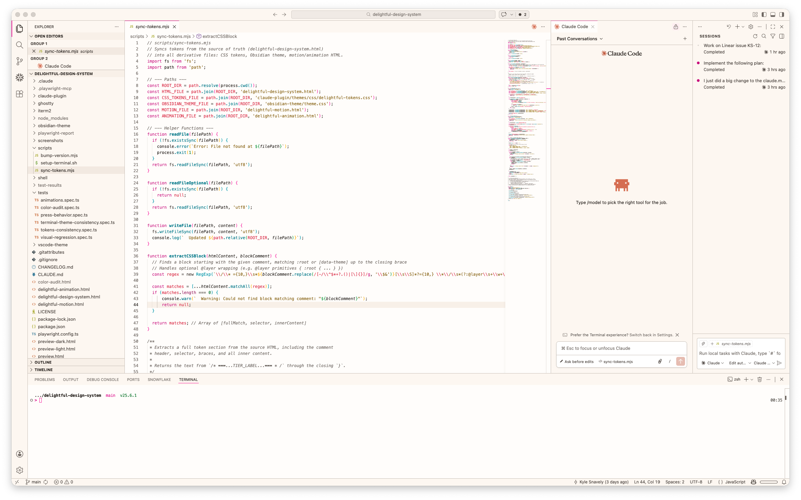

<p align="center">
  <picture>
    <source media="(prefers-color-scheme: dark)" srcset="screenshots/VSCode-Dark.png" />
    <source media="(prefers-color-scheme: light)" srcset="screenshots/VSCode-Light.png" />
    
  </picture>
</p>

<h1 align="center">Delightful for VS Code</h1>

<p align="center">
  A warm, neo-brutalist color theme for Visual Studio Code, derived from the <a href="https://github.com/kylesnav/delightful-design-system">Delightful Design System</a>.
</p>

---

## Variants

- **Delightful Light** — warm cream backgrounds with high-contrast accents
- **Delightful Dark** — amber-tinted dark backgrounds with vibrant syntax colors

## Install

### Manual install

```bash
cd vscode-theme
npx @vscode/vsce package
code --install-extension delightful-theme-*.vsix
```

### From source (development)

```bash
cd vscode-theme/scripts
npm install
node generate-themes.mjs
code --extensionDevelopmentPath=/path/to/vscode-theme
```

## Syntax Highlighting

| Scope | Color |
|-------|-------|
| Keywords | Pink (brand accent) |
| Strings | Gold |
| Functions | Cyan |
| Comments | Muted neutral, italic |
| Numbers | Green |
| Properties | Soft pink |
| Types | Bright cyan |
| Constants | Red |

## Color Palette

All colors are derived from the Delightful Design System's OKLCH tokens:

| Role | Light | Dark |
|------|-------|------|
| Background | Warm cream (`bg-surface`) | Amber-tinted dark (`bg-surface`) |
| Text | Deep warm brown (`text-primary`) | Light cream (`text-primary`) |
| Accent | Hot pink | Lighter pink |
| Danger | Warm red | Bright red |
| Warning | Gold | Gold |
| Info | Cyan | Bright cyan |
| Success | Green | Bright green |

## Regenerating

When design system tokens change, regenerate the theme files:

```bash
cd vscode-theme/scripts
node generate-themes.mjs
```

The generator reads OKLCH token values and converts them to hex using [culori](https://culorijs.org/).

## License

[MIT](LICENSE)
